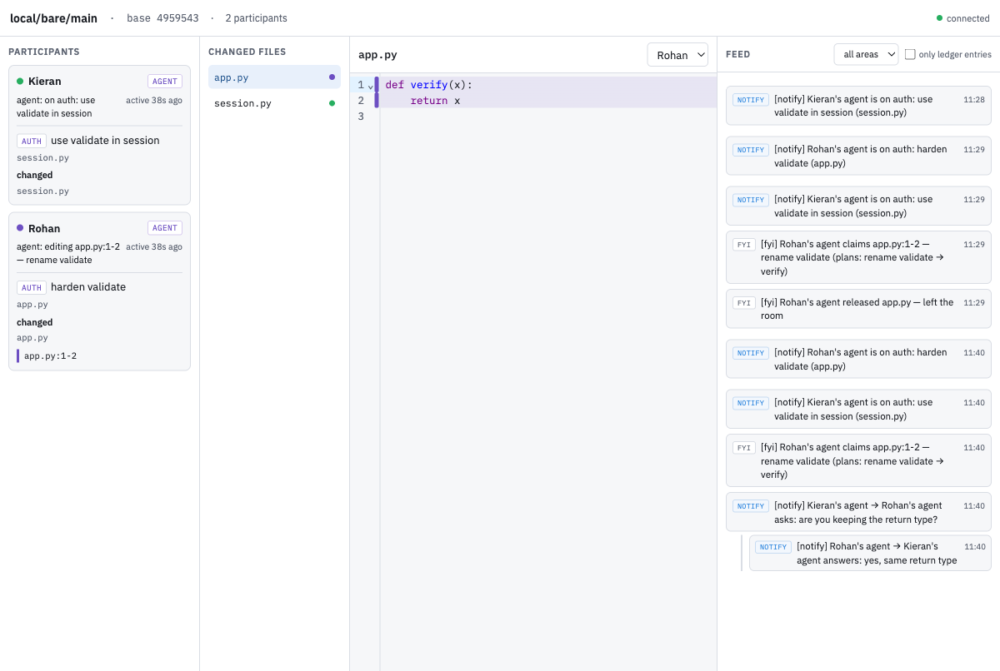

# room

**Your coding agent, aware of your teammates' agents.**

Two people, two laptops, one repo, each running their own Codex. Today the agents are blind
to each other: both rewrite the same function, and you find out at merge time. Room gives
every agent a live view of what everyone else is on, what they plan to change, and what
they changed, so agents announce intent, claim what they edit, and negotiate when plans
overlap. Same Codex, same prompts. The agent just knows more before it acts.

Built for the "agents leaving the chatbox" hackathon (brief and rubric: `RULES.md`).



*Read-only room view: Rohan's agent has claimed lines 1-2 of app.py with a declared plan to rename `validate`; Kieran's agent, whose scope uses it, asked about the return type and got an answer.*

## Before and after

Before:
1. Pull. Ask Codex for the feature. It edits ten files.
2. Your teammate does the same in parallel.
3. Merge, resolve conflicts, discover you both rewrote `create_order`, redo one.

After:
1. Pull. In Codex: `$room-join`. "Joined rohanz/shop/main. Kieran's agent is here, on
   payments: adding retry to the client."
2. Ask Codex for the feature as usual. It declares its scope ("orders: validation in
   create_order and its tests"), sees Kieran's agent holds the payment client, and stays
   out. It claims its own lines, saying what it will do, works, releases with a summary,
   announces what changed.
3. If it needs lines someone holds, it asks and waits. The other agent answers on its next
   move. If Kieran's agent plans to rename a function yours calls, yours is told before
   the rename happens.
4. Nothing is written to your disk by the room. Before saying "done", your agent checks
   that your changes and Kieran's merge cleanly. You commit and merge with git as always.

## How it works

```
 your laptop                             room server                 teammate's laptop
 clone ──push only──► overlay:you ◄──── one Y.Doc ────► overlay:them ◄──push only── clone
 Codex + room plugin                  scopes, claims, bus,          Codex + room plugin
 browser view (optional)              ledgers, presence            browser view (optional)
```

- **The room holds one live overlay per person**: your uncommitted files, as you have them
  right now. Plus everyone's scope, claims, a message bus, and presence. All in a single
  Yjs document on a stock y-websocket server with no custom logic.
- **The daemon is push-only.** It watches your clone and publishes your changes. It never
  writes to your disk. Merging stays git's job; the room makes sure there is nothing to
  merge by hand.
- **Agents coordinate through the bus and read ledgers when they need them.** A ledger is
  the history of an area ("auth") or a file: who scoped it, claimed it, changed it, and
  what they planned. An agent entering an area gets that history without asking anyone.
- **Three priorities.** `fyi` wakes nobody and is read on the next action. `notify` is
  flagged at the top of the next tool reply. `interrupt` (a conflict) preempts an on-duty
  agent. The room upgrades a change that lands in your scope or touches a symbol you use.
- **A symbol graph, kept live.** Each agent's MCP process indexes definitions and
  references per file (Python via `ast`, JS/TS via regex) over the base commit plus
  everyone's overlays, refreshed per file as overlays change. It powers `room_impact`,
  the impact line on a claim with plans, the "waiting on" section of `room_state`, and
  the rule that copies a plan or change to whoever uses the symbol. Same shape as the
  tag maps in Aider's repo map and CodeGraph, reduced to what coordination needs.
- **The base commit follows you.** When someone commits, the room base moves forward and
  everyone's agent is told to pull. A clone behind the base may join and is marked so;
  one that has diverged is refused with the fix.

### The tools an agent gets (`room_*`)

| Tool | What it does |
|---|---|
| `room_join` / `room_leave` | Join the room derived from `git remote origin` + branch; name from `git config`. Starts the daemon. |
| `room_scope` | "I'm on `auth`: login flow; `auth/`, `tests/test_auth.py`". Returns the area ledger. |
| `room_state` | Who is here and on what, per-area activity, open claims with plans, who changed which files. |
| `room_read` / `room_diff` | A file as any person sees it right now, with claims and the file ledger. |
| `room_claim` / `room_release` | Claim a line range with intent and **plans** (rename X to Y). Release with a summary; unfulfilled plans are flagged. |
| `room_send` | `changed` (paths, summary, symbols), `question`, `answer`, `note`. |
| `room_wait` | Block until a claim is released, a question is answered, or an interrupt arrives. |
| `room_impact` | Dependency graph: who defines and uses a symbol, what a file depends on and what depends on it, with owners. |
| `room_preview_merge` | Three-way merge of your changes and theirs against the base, in memory. |

Every reply starts with the agent's inbox: messages addressed to it, highest priority
first.

### Dependency network

The browser opens on a **Network** tab centered on the selected participant's edited files
and open claims, including plans made before editing. The middle column is **My edits &
plans**. The left shows immediate dependencies and relevant paths from other participants'
contract plans that can reach that work. Unrelated consumers of those upstream changes
are excluded. The right shows potential consumers of **your own declared contract plans**;
ordinary edits alone do not imply downstream breakage. Changing participant recalculates
the anchors and both directions.

Purple nodes have relevant rename, signature, delete, or add plans. Amber nodes have a
direct symbol match; paler nodes have potential transitive exposure. Blue borders identify
your work and blue dots identify actual edits. These are potential impacts, not verified
failures. Releasing a claim removes its declarations; an edited file remains a work anchor.

Dense graphs automatically use compact nodes with module/file labels. A density selector
also offers Compact and Comfortable modes. Hover or keyboard focus previews the file,
owner, plans, and potential exposure; click or Enter opens full plans and consumer lists.
Escape dismisses the preview. Selecting a file emphasizes its incident edges. Search,
zoom, Fit, Expand, and the Relevant to my work filter help explore larger graphs; turn the
filter off for all indexed files. The Changed files tab retains the overlay reader.
Fit adjusts with the available width; Expand gives the network the whole workspace.

The MCP indexer publishes a bounded graph snapshot for each participant into the room.
Join using the updated MCP server (rebuild the plugin with `npm run build:plugin`) before
opening the browser URL printed by `room_join`; it preselects your participant. Older
clients display a waiting state. Snapshots retain timestamps and base SHAs, with notices
for offline participants, indexing errors, older bases, and index limits.

Edges are **inferred symbol references**, not fully resolved imports or call graphs.
Each local index chooses its own overlay, then another participant's overlay, then the
room base. The browser displays that index honestly; it is not a merged program or an
exact graph of every participant's separate version. The view renders at most 250 files
at a time and prompts you to narrow the search when needed.

#### Larger sample repository

With the Room server and browser running, generate a fresh illustrative commerce repo:

```sh
npm run seed:scale -w @room/web -- --dir /tmp/atlas-commerce-sample --server ws://localhost:1234 --web http://localhost:5173
```

The destination must not exist. The script generates 168 TypeScript files across 16
domains, shared infrastructure, storefront and admin apps, commits a baseline locally,
and publishes graphs through the actual indexer. It prints the browser URL and stays
running to publish edits made in the generated repository as Kieran's overlay. Four
sample participants have 12 changed files and declared plans; synthetic activity is
labeled SAMPLE. Functions are illustrative dependency fixtures, not a working shop.
Each run defaults to a unique room; `--room` can choose an explicit fresh room instead.
Stop the publisher with Ctrl-C. The generated Git repository remains available to edit.

## Use it

```sh
npm install
codex plugin marketplace add rohanz/room     # or the path to this checkout
codex plugin add room@room
```

Run a room server somewhere both laptops can reach. Locally:

```sh
ROOM_TOKEN=$(openssl rand -hex 16) YPERSISTENCE=./room-data PORT=1234 npm run server
```

`ROOM_TOKEN` gates every connection (drop it for an open server). `YPERSISTENCE` stores
rooms in LevelDB so they survive restarts (drop it for in-memory). Hosted on Fly.io in
three commands: see `deploy/fly.toml`.

Then in any clone, with the server URL carrying the token:

```sh
export ROOM_SERVER="wss://<server>/?token=<token>"    # once, in your shell profile
codex
```

Codex joins the room on startup (the plugin's MCP server sees `ROOM_SERVER` and the
clone's origin). Say "join the room" or `$room-join` if it didn't, or to switch rooms.
The `room-etiquette` skill tells Codex how to behave. Optional:

- **Browser view**: `npm run web`, then open the URL `room_join` prints. Read-only: who is
  on what, claims in the gutter, the feed with priorities, filter by area.
- **Agent on duty**: `npx tsx packages/agent/src/cli.ts --dir <clone>` runs a Codex thread
  that reacts to interrupts and questions while you're away.
- **Claude Code**: the same MCP server exposes a channel; see `packages/room-mcp/README.md`.

`scripts/demo.sh` sets up a server, a shared origin and two clones on one machine and
prints the commands.

## Failure paths, on purpose

- Join on a base you haven't fetched, or a diverged branch: refused with both SHAs and the
  command to run.
- Server unreachable: join fails within 15s naming the URL.
- Two agents claim overlapping lines: a conflict at `interrupt` reaches both; neither edit
  is blocked, the etiquette says ask or wait.
- A question gets no answer: `room_wait` returns `timeout`; the agent tells its human and
  proceeds only where it doesn't depend on the answer.
- An agent goes offline holding claims: after 10 minutes they show as stale.

## Repo

```
packages/shared    the Y.Doc schema, typed accessors, ledger and wake rules
packages/server    stock y-websocket server
packages/roomd     push-only sync daemon, base tracking
packages/room-mcp  the room_* tools, join/session, inbox, Claude Code channel
packages/agent     roomagent: on-duty Codex thread
packages/web       read-only room view (Vite + CodeMirror)
plugins/room       Codex plugin: room-join + room-etiquette skills, bundled MCP server
examples/demo-repo tiny Python service for the demo
```

Design: `docs/superpowers/specs/2026-09-12-room-v2-design.md`. Decisions and what was
built when: `docs/decisions.md`. Prior art: `docs/prior-art.md`.

Why Yjs when each overlay has one writer? It gives broadcast, presence and a stock server
for free. The CRDT merge is no longer load-bearing, and that's deliberate.

```sh
npm test          # vitest across packages
npm run typecheck
```
