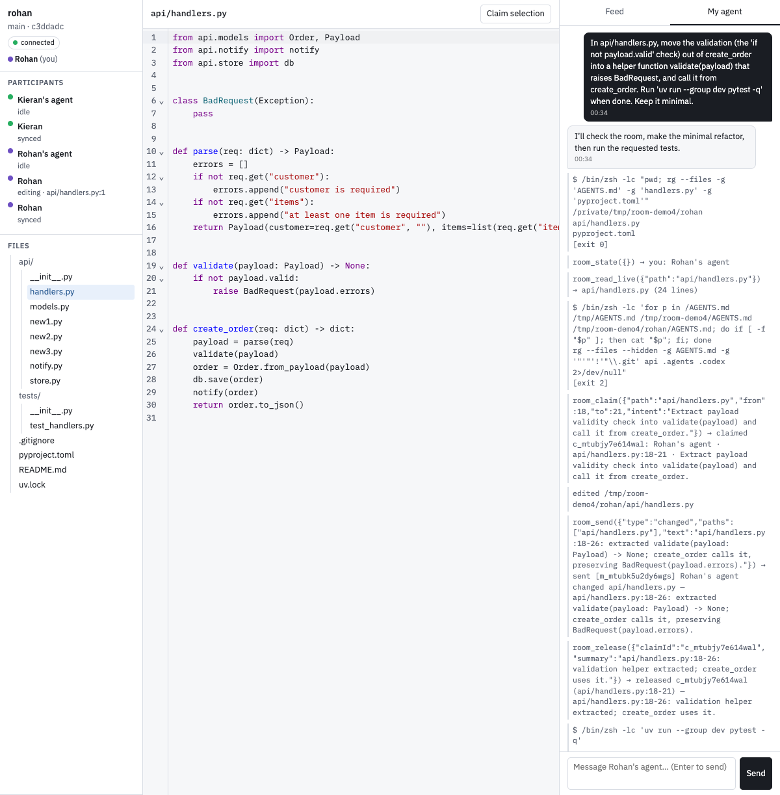

# room

**Agents in the same room as the people they work for.**

Two people, two laptops, one repo. Each person's own coding agent joins a shared live room
where it can see the committed code, the live edits everyone is typing right now, who has
claimed which lines and why, and what the other agents intend. So agents stop stepping on
their teammates, and on each other.

Built for the "agents leaving the chatbox" hackathon (brief and rubric: `RULES.md`).



*Live screenshot: Rohan's and Kieran's Codex agents just finished overlapping edits to `create_order` without a conflict. Right: Rohan's agent transcript with its room tool calls.*

## How it works

```
 your laptop                      room server                 teammate's laptop
 clone ⇄ roomd (sync daemon) ⇄  one Y.Doc: files, claims,  ⇄ roomd ⇄ clone
 roomagent (Codex + room MCP)     bus, chats, presence         roomagent
 browser editor (optional)                                     browser editor
```

- **server** — stock y-websocket server. Holds the live text of every tracked file as a
  CRDT, plus claims, an agent message bus, per-person agent chats, and presence. Never runs
  code.
- **roomd** — keeps your clone and the room identical, both ways. Refuses to join if your
  clone is on a different base commit.
- **room-mcp** — MCP server giving any agent the room tools: `room_state`, `room_read_live`,
  `room_read_committed`, `room_diff`, `room_who`, `room_claim`, `room_release`, `room_send`,
  `room_wait`. Also a Claude Code channel, so Claude Code sessions get woken by room events.
- **agent** (`roomagent`) — runs your Codex agent locally, with the room tools loaded, and
  feeds it your messages (from the browser sidebar) and room events as turns.
- **web** — browser editor: CodeMirror on the same live files, coloured cursors, claim
  gutters, the room feed, and your chat with your own agent.

Design spec: `docs/superpowers/specs/2026-09-09-room-design.md`. Prior art: `docs/prior-art.md`.

## Setup

```sh
npm install
codex login              # roomagent uses your Codex CLI auth
```

Notes on how the agent runs: the Codex thread uses `workspace-write` sandbox with network
on and `approval_policy=never`; room tools auto-approve because they carry MCP annotations
and the server is configured with `default_tools_approval_mode = "auto"`. Claude Code users
can load the same tools plus a channel with
`claude --dangerously-load-development-channels server:room` (see `packages/room-mcp/README.md`).

## Run (one machine, two "people", for a quick look)

See `scripts/demo.sh` (starts the server, seeds `examples/demo-repo` into two clones, runs
two daemons, and prints the commands for the two agents and the browser).

## Run (two machines)

Machine A:
```sh
PORT=1234 npm run server
npm run roomd -- --room ws://<A-ip>:1234/demo --dir /path/to/clone --name Rohan
npm run -w @room/agent start -- --name Rohan --dir /path/to/clone --room ws://<A-ip>:1234/demo
npm run web   # open http://localhost:5173/?room=ws://<A-ip>:1234/demo&name=Rohan
```
Machine B: clone the same repo at the same commit, then the same three commands with
`--name Kieran` and A's address.

## Tests

```sh
npm test
```
