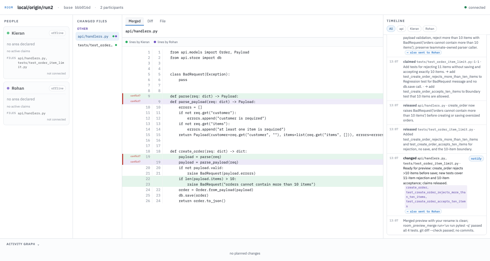

# Room

Room lets your coding agent see what teammates’ agents are changing and coordinate while you work.

```sh
codex plugin marketplace add rohanz/room && codex plugin add room@room       # Codex
claude plugin marketplace add rohanz/room && claude plugin install room@room # Claude Code
```

Both commands fetch the plugin from GitHub with your own git access, so a private fork installs
the same way for anyone who can read it.

Start your agent as usual; by default nothing leaves your machine. Say **“join the room”**
to work with teammates. **Team rooms are currently per branch: everyone in a trial must work
on one shared branch.**

Claude Code 2.1.224 or later wakes with plain `claude` after installation (2.1.234 on
native Windows). See [Claude Code wake-ups](#claude-code).

## Getting started

You need Git, Node.js 24 LTS, and Codex or Claude Code with plugin support. Trust Room’s hooks
when prompted or through `/hooks`. The demo uses `uv`.
Start in your repository and ask for your feature as usual. Room stays silent while you work alone.
[Walk through a first session](docs/onboarding.md).

**With no server configured or team choice remembered, the session is in a local room:**
no account, no login, nothing leaves your machine. The first session in a clone starts a
tiny relay next to the clone's `.git`; any other session started in the same clone, or in
a worktree of it, joins the same room. The room is named `local/<repo>/<branch>` after the
main worktree's branch.

Ask **"Show room state"** to see who is in the room. Then ask for your feature as usual.

**“Join the room”** moves the session to the team room for this repo. **“Work locally”**
brings it back. The choice is remembered in the clone’s common Git directory and applies to
its worktrees; `room_leave(forget=true)` clears it. Later sessions reuse that choice.
Explicit destination arguments take precedence over `ROOM_SERVER`, then legacy `ROOM_URL`,
then the remembered choice, then local. Environment overrides are not saved as your choice.
An agent never switches to a team room on its own initiative.

On the first join to each server from a worktree, the agent relays one disclosure, including
when you are alone or the destination came from an environment variable:

> This clone now shares {sharing level} with members of {repo} on {server}; use room_share level=intent for plans only or level=declared to limit files to your declared area.

The sharing level is stated plainly: “the full text of files you change”, “only the files in
your declared area”, or “only your plans, no file text”.

When a second agent is tagged automatically (for example, `rohanz+claude`), that tag sticks
to the clone across sessions so an offline overlay cannot be mistaken for another clone's work.

Areas come from `CODEOWNERS` at the room's base commit, not from the working tree. When
there is no matching `CODEOWNERS` area, an uncommitted file makes its top-level directory
an area only for the person who changed that file.

**Sharing levels.** By default the room sees the full text of files you change (`full`).
`ROOM_SHARE=declared` shares text only under the paths you declared in your scope, `intent`
shares plans and claims with no file text; `room_share` changes it live and a server can set
a ceiling. For a first trial, keep the default `full`: finished uncommitted output at `declared`
becomes unreadable after `room_done` and is withdrawn on restart. Reading someone who shares less
degrades to a one-line answer rather than an error. An unrecognised sharing level falls back to `intent`
and reports the invalid setting; it never widens sharing to full text.

**What reaches an agent.** Routine events (scopes, releases, change notes) stay in the feed;
an agent's inbox only gets what is addressed to it, conflicts on its claims, and interrupts,
and `room_state` shows the people and claims near its own work in full with one line for
everyone else. The bus keeps a rolling window and folds older history into a ledger archive.

### Watching a local room

Ask for the browser link when you want to inspect participants, tasks and activity. A local
view is served by the relay at `http://127.0.0.1:<port>/?room=…&key=…`; it only accepts
loopback connections. The link carries the key from the Git directory’s `room-local.json`.
Anyone on this machine who holds the link can read the room.

The view link needs a running session. Room history, worker records, scopes and colours
are kept privately in the clone’s git common directory (`room-local/*.ydoc`), never shared.
Live file text and claims are rebuilt by connected sessions. `room_close confirm=true`
exports the ledger and forgets the local room’s saved memory; `room_leave` preserves it.

### Dispatching workers

Room caps math-library threads per worker; include the spawn reply’s budget in compute-heavy tasks, use `threads` (or `ROOM_WORKER_THREADS` on the lead) to override it, and stagger heavy jobs.
`ROOM_WORKER_MAX_BUDGET_USD` caps each Claude worker with the documented `--max-budget-usd`
flag. Set it on the lead before spawning workers.

Ask in your own words: "use a couple of subagents for this" or "split this up".
The agent loads the room-workers skill and handles dispatch, questions, preview and merge.
Workers report progress when they finish; they send an early note only when their lead
needs it to continue. Such progress notes do not wake the lead. A wait lasts at most
100 seconds per call and can be repeated while work continues.
You do not need to know any tool names. For example:

> Use a couple of subagents for this: add the endpoint in api.ts and its tests in api.test.ts.

For a long batch or three or more workers, you can hand coordination to a **background
lead**. Your session spawns one lead worker, which dispatches the other workers, stays
available for their questions, previews and tests their combined changes, and collects
them before finishing. Your session can keep talking with you and can steer that lead
by sending to its full `<lead>+<tag>` name. When it finishes, your session collects its
work as uncommitted edits. For one or two workers, your session can lead directly.

`room_spawn` creates a Git worktree at `.room/workers/<tag>` on branch `room/<tag>`.
Set `carry: false` to start a worker from HEAD without the lead's uncommitted files.
Each worker receives its own `PORT` for a development server.
Eligible tracked uncommitted changes are carried in a commit at the base of the
worker's `room/<tag>` branch; `git push --all` can publish that tracked work until
the worker is collected or discarded. Non-ignored untracked files are copied into
the worker worktree, never committed to a branch. Their spawn-time contents live
only under a private Git ref for merge and recovery; ordinary branch pushes do not
include them (`git push --mirror`, which pushes every ref, would).
Files over 5 MB or beyond 50 MB total, nested repositories, escaping symlinks and
linked inputs are not carried; the spawn reply names them. Carried files remain the
lead's, so a worker coordinates with the lead before editing them. Room reports only
the worker's own work as worker output.
It uses the caller’s agent host unless you choose another. The worker joins as `<you>+<tag>`,
declares its task, coordinates where work overlaps, previews the combined changes, and finishes
with a one-line summary. Up to eight workers run at once (`ROOM_MAX_WORKERS`).
On Claude Code 2.1.224 or later, Room wakes idle Claude workers through their
cross-session messaging inbox. No launch flag is needed. Native Windows needs 2.1.234.
Claude workers load the optional channels fallback only with `ROOM_WAKE=channels`.
Send a message to a finished worker's full `<you>+<tag>` name to resume its retained
session in the same worktree. It can address review findings with its prior context.
A collected or discarded worker cannot resume.

The lead calls `room_collect()` once to collect all its finished workers, in finish-time order
(with tag as the tie-breaker). An optional `tag` selects just one. Changes arrive in its working
tree **uncommitted and unstaged**, preserving its own edits. Any conflict leaves all files
untouched and names the paths and tags involved. Running and failed workers are skipped.
Collection never commits; when requested, the agent uses plain Git for one normal task commit.
`mode: "copy"` with `tag` and `paths` collects named artifacts, including ignored files.
Full successful collection removes the exited worker's temporary files, branch and logs.
Regenerable build output such as `dist/`, `.astro/`, `test-results/` and `node_modules/`
does not keep a collected worktree. Failed or partial collection preserves recoverable work.
Collect, discard and stop terminate processes running inside a worker worktree.
Parallel collections queue and name the worker ahead of them; collect-all skips bad
worker records and reports why.

`discard: true` stops a worker without collecting output, saves tracked and non-ignored changes
in a recovery patch for one week, then removes the worktree, branch and logs. If the worktree
contains ignored artifacts outside dependency and cache trees, discard refuses before deletion,
lists those artifacts and keeps the worktree so you can copy them explicitly; a repeated forced
discard knowingly deletes them and reports what was removed. Room excludes
`.room/` through Git’s private exclude file automatically.

Workers of one lead see each other, so two of them touching the same function get the
same claims and conflict notices as two teammates would.

Room's Claude Code routing evals live under repo-root `evals/`. From the repository root,
run `claude plugin eval . --scaffold --allow-tools Edit Write` with Claude Code 2.1.269 or
later. The suite clones a pinned demo repository, so it needs network access, and it makes
model calls. Add `--trust-plugin` in a noninteractive runner and `-j 3` for parallel cases.
The nine-case suite took about 12 minutes and reported a $12 list-price estimate with
`-j 3` in the 2026-09-24 validation run.
See the [plugin eval guide](https://code.claude.com/docs/en/plugin-evals).

### What Room writes

Live sharing does not apply another participant’s edits to your working tree. In your repository,
Room’s bookkeeping lives only inside the Git directory and `.room/`. Bringing in a worker’s
output changes project files when requested; exports write the room’s story to `.room/ledger/`.

- The worktree’s Git directory holds `room.json` (migrated from the old root `.room.json`)
  and hook/session state.
- The common Git directory holds `room-choice.json` (the remembered destination),
  `room-local.json` and `room-local/*.ydoc` (local relay discovery and history), and
  `room-mcp.log`. The log records timestamped MCP events from sessions and workers,
  including room selection, relay activity, join attempts and failures, readiness and
  leaving. It is mode 0600 and rotates at 1 MB, keeping one older generation
  (`room-mcp.log.1`); `ROOM_LOG_FILE` still overrides the location.
- `.room/workers/` holds worker worktrees and logs until successful collection or clean-worktree dismissal cleans them up.
  Room adds `.room/` to Git’s private `info/exclude`; no tracked ignore-file edit is needed.

Outside the repository, login sessions are saved in `~/.config/room/credentials.json`
(`XDG_CONFIG_HOME` or `ROOM_CREDENTIALS` can override it). Merge previews use temporary
`room-merge-*` and `room-merge-file-*` directories under the operating system’s temp directory.

## Team rooms

To work with teammates on other machines, point the plugin at a server:

```sh
ROOM_SERVER=hosted codex          # team server, wss://room-rohanz.fly.dev
ROOM_SERVER=wss://room.example.com codex   # your own (see deploy/self-hosting.md)
```

The first person on a repo opens it once: ask **"Open a room for this repo"** (the agent
calls `room_create`). From then on every branch of that repo has a room, and each session
started in a clone joins the room for its current branch automatically:
`github.com/<owner>/<repo>/<branch>`. Nothing about your clone leaves your machine until
that join happens, and no session joins a repo nobody has opened. Everyone in a trial must
currently work on one shared branch; removing this boundary is the next planned change.

The first time you use a server, the agent runs `room_login`: open the GitHub device
page it prints, enter the code, and approve Room. The server holds the resulting token
(revocable under GitHub → Authorized OAuth Apps); your `gh` token is never sent anywhere.
Your participant name is your GitHub login. To open or join a repo you need push access
to it, so public repos are not open rooms. A browser link requested with `room_state(link=true)` contains a
room-scoped view key valid for 7 days, rather than your GitHub token. Treat that link as
access to the room's shared code and activity.

Everything from the local workflow applies unchanged: the same tools, etiquette, and
workers. A lead's workers join the team room when the lead is in one, unless you ask for
them locally.

**Workers stay local.** Say "spawn the workers locally" (or `room_spawn` with
`where=local`) while you are in the team room: the lead opens a local workers room on
your machine, dispatches into it, and bridges the two. Workers never touch the server. The
team room sees the lead's scope as the union of its workers' paths, sees their claims under
the lead's name (`[tag] intent`), and any team message that touches a worker's files is
relayed to that worker as an interrupt. Questions from workers and their done messages
stay on your machine; `room_state` shows both rooms.

## Claude Code

Claude Code 2.1 or later uses the same plugin as Codex. For a local checkout, install the
marketplace with `claude plugin marketplace add /path/to/room`.

Claude Code 2.1.224 or later on macOS, Linux or WSL 2 wakes with plain `claude` after
installation; native Windows needs 2.1.234. Check with `claude --version`. Room sends
a short wake to the session's cross-session messaging inbox for interrupts and messages
addressed to you, such as a question or a worker finishing. The first event wakes the
session immediately; events in the next five seconds produce at most one follow-up wake,
coalesced into one line, for example: `[room] 2 things need you: rohanz+ship asked a
question; rohanz+cat finished. Use the room_state tool to read them (room_collect brings
in finished workers). (#3)`. Background chatter stays in the room. Claude Code frames
the wake as “Another Claude session sent a message” with a
safety preamble. The wake is a prompt to check Room, not user authority, and does not
mark the room message read.

`ROOM_WAKE=socket|channels|off` selects one wake path for the process. By default, Room
uses the socket when available and falls back to an admitted channel if the socket is
absent or a send fails. `ROOM_WAKE=channels` forces channel notifications;
`ROOM_WAKE=off` disables wakes for this process. On older
Claude Code, `plugins/room/bin/claude-room` starts the optional channels fallback with
`--dangerously-load-development-channels plugin:room@room`; it can also be run through
your own shell alias. Channels are a research preview and require that per-session flag.

If `crossSessionInbound` is `hold`, Claude Code holds the socket wake until the setting
allows it; `refuse` drops the wake. Room messages remain available on the next Room turn. An
organisation can disable cross-session messaging for claude.ai Team or Enterprise
accounts. Update Claude Code first if Room says a session cannot be woken, then use
`claude-room` as the older-version fallback. Codex uses `codex queue`.

### Updating the plugin

Update the marketplace and reinstall the plugin using your host’s plugin commands. For Claude Code:

```sh
claude plugin marketplace update room
claude plugin install room@room
```

An update applies to **new sessions**. Start a new session after reinstalling; a session already
running keeps its original tools and instructions. Room reports "Room was updated on disk;
restart this session to pick up fixes" when it detects a newer plugin bundle. If a hook definition changes, trust it again
when your host asks. `claude plugin validate plugins/room` checks a local manifest.

## Status

[](https://github.com/rohanz/room/actions/workflows/ci.yml)

Room has been tested live with a small team on GitHub-hosted repositories and in solo mode on macOS.
That coverage includes local rooms, Claude Code and Codex workers, and teams using mixed agent hosts.
It has also been soak-tested with 10 scripted participants.
OIDC, the Postgres store, Windows, and large monorepos are designed and unit-tested only.

## What we built

Two developers ask their agents to change the same codebase. One changes the order model;
the other adds coupons to the checkout that consumes it. Their work can break together
even when Git reports no conflicting lines.

Developers already resolve these integration issues through review, communication, and
rework. Room aims to prevent avoidable conflicts and incompatible assumptions before
they become implementation problems, reducing rework and speeding up iteration.

Room is a coordination layer for developers and small teams using coding agents
in parallel on the same repository and branch. It connects the agents inside their existing Git
clones and Codex sessions. They share
live edits, declare intended contract changes, identify affected teammates, and ask each
other questions before the work is merged. Developers keep their own editors, agents,
and Git workflow.

Built for the **“Agents leaving the chatbox”** hackathon.
[Read the brief and judging criteria](RULES.md).

## Why the environment matters

A chat prompt does not contain your teammate’s uncommitted code or their latest change
of plan. Room combines file watching, Git state, declared intent, and symbol references
to give agents that context while they work.

- **Before an edit:** the agent can see who holds the lines and what they intend to change.
- **When a contract changes:** relevant consumers receive the declaration; superseded or
  cancelled plans generate interrupts for affected agents.
- **When an agent is idle:** the plugin can queue an interrupt or addressed question into
  its Codex session, provided the session bridge is available.
- **Before integration:** agents can preview a merge and run checks; developers retain
  control of commits and pushes.

Claims are advisory. Room helps agents coordinate; it does not lock files or guarantee
that their changes are compatible.

## Browser interface

People and Board cards show models reported by session hooks or explicit worker settings, plus explicitly requested worker effort; unknown values stay hidden.



*File-view screenshot from an earlier two-agent run: participant changes, possible
conflicts, and the coordination timeline. The current UI also includes the Network tab.*

### Dependency network

Choose a participant to explore three directions:

| View | What it shows |
|---|---|
| **Upstream** | Dependencies of their work, including teammates’ contract changes that reach it. |
| **My edits & plans** | Their modified files and open claims, including plans declared before editing. |
| **Downstream** | Potential consumers of their contract changes: importers of a symbol whose signature they announced or changed. |

A contract change has two sources. An **announced** plan is declared on a claim before the
edit, and reaches consumers immediately. An **observed** change is read from the diff: when
a definition line (a `def`, `class`, `function` or exported `const`) differs from the base
commit, the room treats it like a plan on that symbol and tells anyone whose changed or
claimed files use it. Body-only edits produce nothing. Where both exist for a symbol, the
announcement wins. **Blue** means actual file edits; **purple** means a contract change. A
diagonal blue/purple fill means both. **Red** marks potential contract impact; affected
nodes with edits or plans retain their fill and gain a red outline. Neither source proves
the change is finished; the merged-tree test run is the proof.

Participant colours are assigned in join order from an eight-colour palette and kept for
the life of the room. Colours repeat after eight participants; names disambiguate people.

Hover or keyboard focus gives a preview; click or Enter opens dependencies, owners,
plans, and consumer details. Search, participant selection, compact nodes, zoom, Fit,
and Expand help navigate larger repos. Turn off **Relevant to my work** to explore all
indexed files. **Changed files** opens the merged preview, diff, and file reader alongside
the participant and timeline views.

## Implementation

```text
Developer A’s clone                                  Developer B’s clone
       │ file watcher                                       │ file watcher
       ▼                                                    ▼
  Room MCP + daemon ───── shared Yjs room over WebSocket ── Room MCP + daemon
       ↕                         │                          ↕
  Codex + hooks            Browser view                Codex + hooks
```

1. **Publish local changes.** The push-only daemon watches each clone and publishes its
   file overlays and deletions. An overlay is a participant’s current version of a file
   relative to their Git base. Live sharing never applies remote edits to your working tree.
2. **Share coordination state.** One Yjs document holds overlays, per-person bases,
   scopes, line claims, declared plans, messages, and graph snapshots. Area and file
   ledgers give agents the relevant history.
3. **Find relevant consumers.** Each MCP process uses tree-sitter to index definitions,
   references, imports and definition signatures over the base plus overlays. It uses the
   index to route relevant plans and changes, answer impact queries, and publish the browser
   graph. It supports Rust, Go, C, C++, Java, Kotlin, C#, Swift, Scala, Python, JavaScript,
   TypeScript, TSX, Ruby and PHP. The plugin carries about 27 MB of grammars, but loads only
   those for languages present in the repository. The browser keeps a smaller regex extractor
   rather than loading tree-sitter.
4. **Deliver context.** Room tool replies surface the agent’s inbox. Pre-edit hooks show
   unread messages and teammate claims. The session bridge queues interrupts and
   addressed questions into Codex; an optional on-duty runner also handles room events.
5. **Integrate with Git.** Merge previews happen in memory or, when tests are requested,
   a temporary workspace. The shared base advances only when the new commit is on the
   remote. Teammates see that their clone is behind and can pull.

The server uses `@y/websocket-server` with GitHub device-login (or OIDC) admission, read-only
view keys, size caps, optional LevelDB or Postgres persistence, and static browser hosting.
The separate relay in `packages/relay` implements the local-room wire handler on loopback. Coordination logic runs in
clients: a session registry (`packages/room-mcp/src/registry.ts`) lets one process hold
several rooms, and message routing, views and configuration each live in one place
(`packages/shared/src/messages.ts`, `views.ts`, `packages/room-mcp/src/config.ts`). Yjs
supplies shared state and presence; Git remains the integration mechanism.

### Agent tools

| Tool | Purpose |
|---|---|
| `room_login` | GitHub device login to a team server; `action: "logout"` forgets the login. |
| `room_create` / `room_join` / `room_leave` / `room_close` | Open the repo once on a server; join a room (`where=local`, `team`, or a URL, remembered per clone); leave; close the repo for everyone (destructive, on explicit ask; the story is exported first). |
| `room_export` | Write the room's story, with the compacted bus archive, to `.room/ledger/`. |
| `room_scope` | Declare an area and paths; read that area's history. |
| `room_state` | Sharing boundary, participants and nearby work (`all=true` for everything, `path` for one path, `link=true` for a browser link); identifies offline state. |
| `room_read` | A participant’s live file; `diff: true` reads changes. |
| `room_claim` / `room_release` | Coordinate ownership and plans where work overlaps; task completion releases claims automatically. |
| `room_send` / `room_wait` | Announce changes, ask, answer, note; wait for a release, an answer, an interrupt, or a worker's done message. |
| `room_impact` | Symbol providers, consumers, dependencies, and owners. |
| `room_preview_merge` | Three-way merge with one or several people's live trees, in order; optionally run the tests in the combined tree. The room also tells you when a file you changed stops merging cleanly with a teammate's. |
| `room_done` / `room_pr_note` | Finish a task (release, clear scope, tell the lead if you are a worker; `pr_note: true` posts the branch ledger on its PR); post or update the one room comment on a PR. |
| `room_collect` | Collect all finished workers (or one `tag`) as unstaged edits; conflicts write nothing. Never commits. `tag, discard: true` stops without collecting; `tag, mode: "copy", paths` copies artifacts. |
| `room_spawn` | Dispatch a worker into a worktree, using the caller’s host by default, in this room or a local workers room. |
| `room_share` | Change your sharing level live: `intent`, `declared`, `full`. |

**Pull requests are intent too.** Open PRs targeting the room’s branch are mirrored into the room as `pr#<n>` bot participants owned by their author, with a scope built from the files they touch, so a claim or a symbol change that lands on a file an open PR is rewriting is flagged the same way a teammate’s declared work is. The server fetches them with the GitHub token it holds from device login (`GET /github/prs`, cached a minute); one elected client keeps the mirror fresh every two minutes. In the other direction `room_pr_note` writes the branch’s coordination story onto its PR as a single comment that is edited in place, so reviewers see who declared what, which plans were fulfilled or cancelled, what was asked and answered, and which merge previews passed.

## Limitations and failure handling

- **Potential impact is not verified breakage.** Symbol references are inferred, not a
  fully resolved import or call graph. Runtime behavior and compatibility need tests.
- **The graph is a projection.** An index prefers its participant’s overlay, then another
  participant’s overlay, then the base. It does not represent every separate version at
  once. The browser renders at most 250 files and asks you to narrow larger views.
- **Claims depend on agent cooperation.** Overlaps raise interrupts; they do not prevent
  writes. Cancelled plans and releases update coordination state, not source code.
- **Git and connection failures are visible.** Behind clones are identified; unavailable
  bases or divergence at join require fetching or reconciliation. Connection attempts
  time out, offline claims become stale, and graph snapshots expose age and status.
- **Sharing follows the selected destination and level.** In a team room, eligible file text
  and coordination history reach the server and participants. Local room data stays on your machine.

## Areas for improvement

**Graph efficiency and accuracy.** Build on the existing symbol index with algorithms
and data structures that reduce repeated work as a repository grows. Forward and reverse
adjacency indexes can support targeted upstream and downstream traversal; incremental
edge updates and cached reachability results can avoid recomputing unaffected paths.
Strongly connected components can group dependency cycles, while module-level aggregation
and rendering only visible nodes can keep the browser responsive on larger graphs.
Language-aware symbol resolution would also reduce false connections from matching names.
These changes should be measured against indexing time, update latency, memory use, and
impact-query accuracy.

**Contract declarations and landed changes.** Make the relationship between an agent’s
intent and the code that actually lands more explicit. Declarations should describe the
old and proposed contract, identify affected symbols, and retain a clear history when a
plan is revised or cancelled. Link those declarations to file revisions and pushed
commits so Room can distinguish a proposed change from an implemented one. Consumer tests
can then provide evidence of compatibility instead of treating an edit or released claim
as proof that the contract is satisfied.

**Incoming data and coordination handling.** Handle arriving edits, declarations, and Git
base updates as a consistent sequence of revisions. Preserve each participant’s version,
reconcile updates against the correct base, and invalidate stale graph results when their
source data changes. Deduplication, batching, and explicit handling of out-of-order updates
would help keep the displayed state and agent context consistent. Recovery should cover
reconnects, abandoned claims, cancelled work, and simultaneous changes to the same file,
with a clear distinction between current activity and retained history.

These are proposed improvements to the prototype, not claims of capabilities already
implemented.

## Local development and verification

```sh
git clone https://github.com/rohanz/room.git
cd room
npm ci
npm run build
npm run build:plugin
```

Start the server and Vite in separate terminals:

```sh
# Terminal 1 — local sample server; state resets when this process stops
HOST=127.0.0.1 PORT=1234 npm run server

# Terminal 2 — browser development server
npm run web
```

To connect Codex to this server, launch it from the target clone with
`ROOM_SERVER=ws://localhost:1234 ROOM_WEB=http://localhost:5173 codex`.
GitHub-named rooms are entered only through GitHub device login (`GITHUB_CLIENT_ID` on the
server, `room_login` on the client); a `gh` token is never forwarded and would be refused. For
local development set `GITHUB_CLIENT_ID=fake`: the server mints a session for any `fakeLogin`
posted to `/auth/poll` (refused under `NODE_ENV=production`; `scripts/demo.sh` uses it). A repo
must be opened once (`room_create`, or `POST /rooms`) before its branch rooms accept
connections. For non-GitHub repos (`local/...`, `git/...`) a shared secret works instead: set
`ROOM_TOKEN` on the server and provide the matching token in the client’s `ROOM_SERVER` URL;
it never admits a `github.com/...` room. Set `YPERSISTENCE` to a directory to retain room
state across server restarts.

The [Dockerfile](Dockerfile) packages the server with a prebuilt browser view (run
`npm run build -w @room/web` first);
[Fly configuration](deploy/fly.toml) describes the hosted deployment and [deploy/DEPLOYING.md](deploy/DEPLOYING.md) is the operations runbook.
To run your own server with GitHub or company (OIDC) login, an audit log and optional
Postgres, follow [deploy/self-hosting.md](deploy/self-hosting.md) (Docker Compose in
`deploy/docker-compose.yml`).
[The MCP README](packages/room-mcp/README.md) covers additional client integration.

### Explore a larger sample

With the local server and browser running:

```sh
npm run seed:scale -w @room/web -- --dir /tmp/atlas-commerce-sample --server ws://localhost:1234 --web http://localhost:5173
```

Use a destination that does not exist. This creates a Git repo with **168 TypeScript
files and 319 inferred dependency edges** across 16 commerce domains, platform modules,
and storefront/admin apps. Four sample participants have 12 modified files: eight
edit-only files and four with both edits and declared contract plans.

The actual indexer builds the graph. Participant activity is synthetic and labeled
`SAMPLE`; the functions are dependency fixtures, not a working commerce application.
The script prints a browser link and stays running so edits in the generated repo update
Kieran’s overlay. Each run gets a unique room unless you supply `--room`. Ctrl-C stops
the publisher and leaves the generated repo intact.

### Checks and repository layout

```sh
npm test
npm run typecheck
npm run build
npm run build:plugin  # regenerate after MCP or daemon changes
```

| Directory | Responsibility |
|---|---|
| `packages/shared` | Room schema, ledgers, symbol graph, and message-routing rules. |
| `packages/server` | WebSocket sync, login and admission, persistence, audit, and browser hosting. |
| `packages/relay` | The loopback relay behind local rooms: discovery file, key, health, browser view. |
| `packages/roomd` | File watching, overlay publication, and Git-base tracking. |
| `packages/room-mcp` | Agent tools (`src/tools/*`), session registry, config, workers, bridge, indexing, hook bridge. |
| `packages/agent` | Optional on-duty Codex runner. |
| `packages/web` | Network, file/merge views, participants, and timeline. |
| `plugins/room` | Installable Codex and Claude Code plugin: hooks, skills, bundled MCP server and browser view. |
| `examples/demo-repo` | Small Python demo service. |

[Original v2 design (historical)](docs/superpowers/specs/2026-09-12-room-v2-design.md) · [Changelog](CHANGELOG.md) ·
[Roadmap](docs/roadmap.md) · [Decisions and build history](docs/decisions.md) · [Prior art](docs/prior-art.md)

## License

Room is released under the [PolyForm Noncommercial License 1.0.0](LICENSE). You may use,
modify, fork and share it for any noncommercial purpose, which includes personal use and
research. Using it at work is not something we intend to pursue. Selling Room, or running it
as a paid service, is not permitted without a commercial licence: open an issue or write to
the author.
