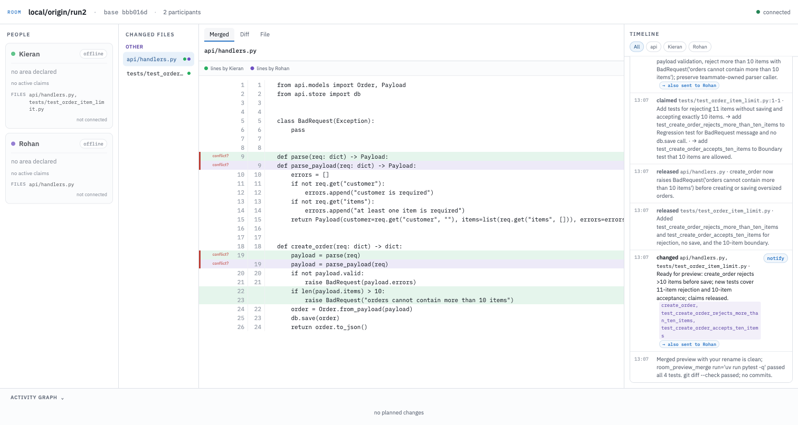

# Room

Room lets coding agents see teammates' work while they are still editing.
Agents can claim code, ask each other questions, and preview their changes together.
Your files and Git workflow stay yours: Room shares context, then you decide what to merge.

## Start in five minutes

You need **Node.js 22+**, **Git**, a repository with at least one commit, and either **Claude Code 2.1.224+** (2.1.234+ on native Windows) or **Codex 0.157+**. The plugin carries its server bundle; you do not need to build it to install from GitHub.

Install for your agent:

```sh
claude plugin marketplace add rohanz/room
claude plugin install room@room
```

```sh
codex plugin marketplace add rohanz/room
codex plugin add room@room
```

In Codex, accept the Room hooks prompt, or trust Room in `/hooks`. Its session-start and before-edit hooks put relevant room context in the agent's path. Start your agent as usual inside your repository. You can simply work: the default **local room** stays on this machine. Say **“join the room”** when you want the team room.

The [defaults table](#defaults-and-how-to-change-them) shows what Room chooses and what to say to change it.

Ask **“show room state”** to check it. A local session starts with `local: nothing leaves this machine`, then shows `room: local/<repo>` and `you: <name> in local/<repo>`. A team session shows `team room:`, `room: github.com/<owner>/<repo>`, and your branch and base. Ask for the browser link to see participants and activity.

If setup seems wrong, ask **“is Room set up right?”**. The agent checks Room state. You can also run `plugins/room/bin/room-doctor` from a checkout, or from the installed plugin at `~/.claude/plugins/cache/room/room/<version>/bin/room-doctor` or `~/.codex/plugins/cache/room/room/<version>/bin/room-doctor` (replace `<version>` with the installed version).

### Work with teammates

One team room covers **every branch of a repository**. You need push access to its GitHub repository.

1. Say **“log in to Room”**. Open the GitHub device page, enter the code, and approve Room.
2. One person says **“open this repo on the server”**. The agent uses `room_create` to open it once.
3. Teammates install Room and say **“join the room”** from their own clones.

The hosted server is `wss://room-rohanz.fly.dev`. To choose it explicitly, launch Codex with `ROOM_SERVER=hosted codex --no-daemon`. For your own server, use `ROOM_SERVER=wss://room.example.com codex --no-daemon` and [self-hosting instructions](deploy/self-hosting.md). Codex's shared app-server daemon does not pass shell `ROOM_*` variables to Room. The agent tells you what the clone will share on its first team join; you can say **“share plans only”** or **“only my declared files”**.

[Follow a first session](docs/onboarding.md) · [Reference and troubleshooting](docs/reference.md) · [Upgrade from 0.16](docs/upgrading.md)

## Defaults, and how to change them

| Default | What it means | Change it |
|---|---|---|
| Local room | Nothing leaves this machine until you choose a team room. Room remembers the choice per clone, including linked worktrees. | Say **“join the room”** or **“work locally”**; use `room_join(where="team"/"local")`. Set `ROOM_SERVER=hosted` or a WebSocket URL to choose a team destination at launch. `room_leave(forget=true)` clears the saved choice. |
| `full` sharing in a team room | Members of that repository's team room, on **every branch**, receive the full text of eligible files you change. A server can lower the ceiling with `ROOM_SHARE_MAX`; your request cannot exceed it. Local rooms stay on this machine. | Say **“share plans only”** for `intent` (plans and claims, no file text), **“only my declared files”** for `declared` (all changed paths, text only in your declared area), or **“share all changed files”** for `full`. Use `room_share(level=...)` or set `ROOM_SHARE` before launch. |
| File publication limits | Room skips files matching `.roomignore`; it also excludes `.env` and `.env.*` except `.env.example`, common build and cache directories, temporary and binary extensions, and untracked lockfiles. It shares at most **512 KiB per file** and **8 MiB total** of changed file text. | Edit `.roomignore` in the clone to exclude more paths. Say **“show room state”** to see skipped files. These built-in limits are not user settings. |
| Worker host, model and effort | The caller's host runs a worker by default. Room passes through a model and effort named in a spawn request; otherwise the host chooses its own default. The spawn reply names what runs when known. | Ask for a specific host, model or effort, or pass `host`, `model`, `effort` to `room_spawn`. Set `ROOM_WORKER_MODEL` / `ROOM_WORKER_EFFORT`, or the per-host `ROOM_CODEX_WORKER_*` / `ROOM_CLAUDE_WORKER_*` pair. |
| Eight concurrent workers | Room caps workers at eight. Its computed CPU and memory budget is shown to each worker; scheduling priority defaults to `nice 10`. | Set `ROOM_MAX_WORKERS` for the count, `ROOM_WORKER_THREADS` and `ROOM_WORKER_MEM_GB` for compute budgets, or pass `threads` to `room_spawn`. |
| No Claude worker cost cap | Room does not set Claude's `--max-budget-usd` unless you choose a cap. | Set `ROOM_WORKER_MAX_BUDGET_USD` before launching the lead. |
| Carry uncommitted work | New workers receive eligible tracked and non-ignored untracked edits: at most **5 MiB per file** and **50 MiB total**. `.roomlinks` lists input paths linked into worker worktrees. | Ask **“start the worker from HEAD”** or pass `carry=false` to `room_spawn`; pass `link=[]` to disable `.roomlinks` for that worker. |
| Automatic wake | Claude Code 2.1.224+ (2.1.234+ on native Windows) uses its cross-session inbox when available, then an admitted channel if needed. Codex uses its queue. | Set `ROOM_WAKE=channels` for the optional Claude channel path or `ROOM_WAKE=off` to stop process wakes; `ROOM_WAKE=auto` restores the default. |
| 30-minute idle lease | An unheld Codex app-server session is retired after 30 minutes idle. | Set `ROOM_IDLE_LEASE_MS` to a positive number of milliseconds. |
| 4 GiB preview cache | Merge previews with checks reuse a cached worktree; `ROOM_PREVIEW_CACHE_GB=0` turns reuse off. | Set `ROOM_PREVIEW_CACHE_GB` to the desired GiB limit. |
| Automatic name tag | When one login has more than one session, Room adds a clone or host tag such as `rohanz+claude` to keep identities separate. | Set `ROOM_TAG` or pass `tag` when joining. |
| Automatic Git base fetch | Room may fetch a missing base commit from the room's remote, at most once per SHA per five minutes. | Set `ROOM_AUTO_FETCH=0` to disable it. |
| Seven-day stale claim threshold | A claim with no active owner is marked stale after seven days. | Set `ROOM_STALE_DAYS` to a positive number. |
| Server cleanup after 30 days | The server closes repositories idle for 30 days and removes legacy branch records 30 days after migration. | Server operators can set `ROOM_IDLE_DAYS` and `ROOM_LEGACY_DAYS`. |
| Server size caps | The server accepts up to 64 MiB per room document and 16 MiB per WebSocket message. Its identity guard observes by default. | Server operators can set `ROOM_DOC_MAX_MB`, `ROOM_MAX_MESSAGE_MB`, and experimental `ROOM_IDENTITY_GUARD=enforce`. |

## How people use it

When you ask your agent to work on a feature, it can announce the files it expects to edit. If another agent is near that code, Room shows the overlap and the agents can claim separate lines or ask each other a question. An addressed question can wake an idle session. Before bringing work together, agents can preview the combined tree and run checks. Claims are advisory; commits and pushes remain your decision.

You can also ask for **“another agent”**, **“agents in parallel”** or **“Codex to do half of this”**. Room runs workers in their own Git worktrees and brings finished work back as uncommitted, unstaged edits. The spawn reply names each worker's host, model and effort when known. Room has no default worker model or effort: a request or worker environment setting can select one; otherwise the host chooses.



The browser view shows participants, changed files, claims, the activity feed and a network of possible effects from changed function signatures. The screenshot is from an earlier two-agent run; the current UI also has a Network tab.

## Status and limits

[](https://github.com/rohanz/room/actions/workflows/ci.yml)

Room has been used live with small teams, local rooms, mixed Claude Code and Codex workers, and GitHub repositories on macOS. OIDC, Postgres, Windows and large monorepos have unit coverage but limited live use. Claims cannot prevent writes. Symbol impact is inferred and needs tests to confirm compatibility. A team room trusts everyone it admits; [the roadmap](docs/roadmap.md) tracks finer permissions and scale work. See [failure handling and diagnostics](docs/reference.md#limits-and-diagnostics).

Room began as an [“Agents leaving the chatbox” hackathon](RULES.md) entry. Its environment matters because an agent can respond to actual uncommitted files, Git bases, teammate plans and questions while you work.

## Contributing

For a checkout, run `npm ci` and `npm run build:plugin`. Add the checkout as a local marketplace with `claude plugin marketplace add /path/to/room` or `codex plugin marketplace add /path/to/room`; Claude Code can also load it with `--plugin-dir /path/to/room/plugins/room`. See [AGENTS.md](AGENTS.md) for the repository layout and test commands, and [local development](docs/reference.md#local-development) for the server and sample.

Room is released under the [PolyForm Noncommercial License 1.0.0](LICENSE). Personal use, research, modification and sharing are allowed; selling Room or running it as a paid service requires a commercial licence.
